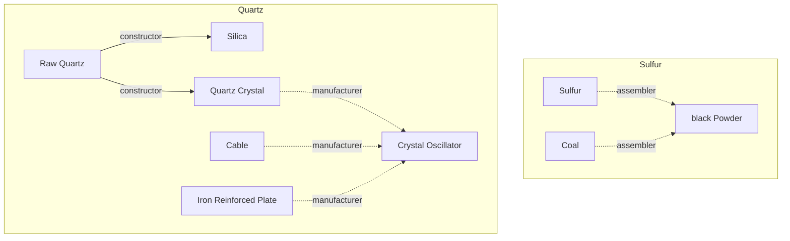
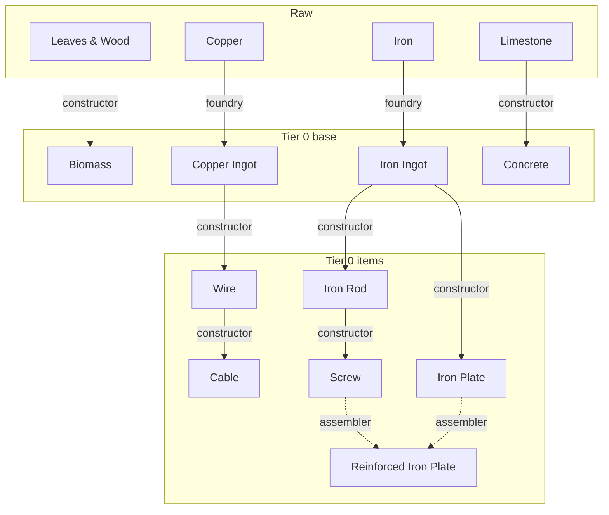
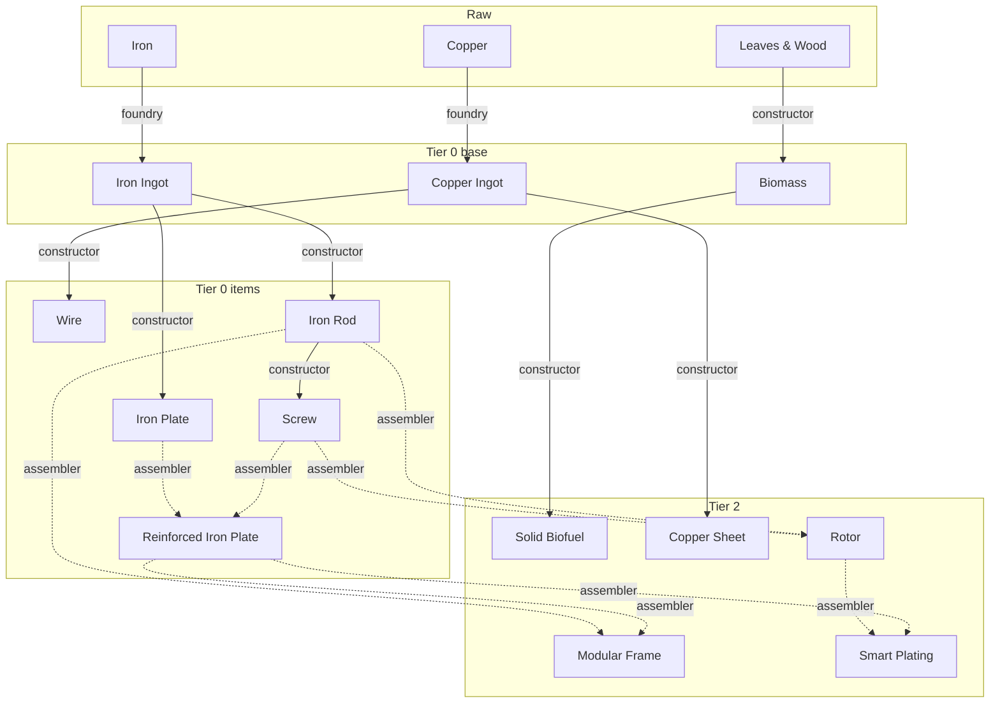
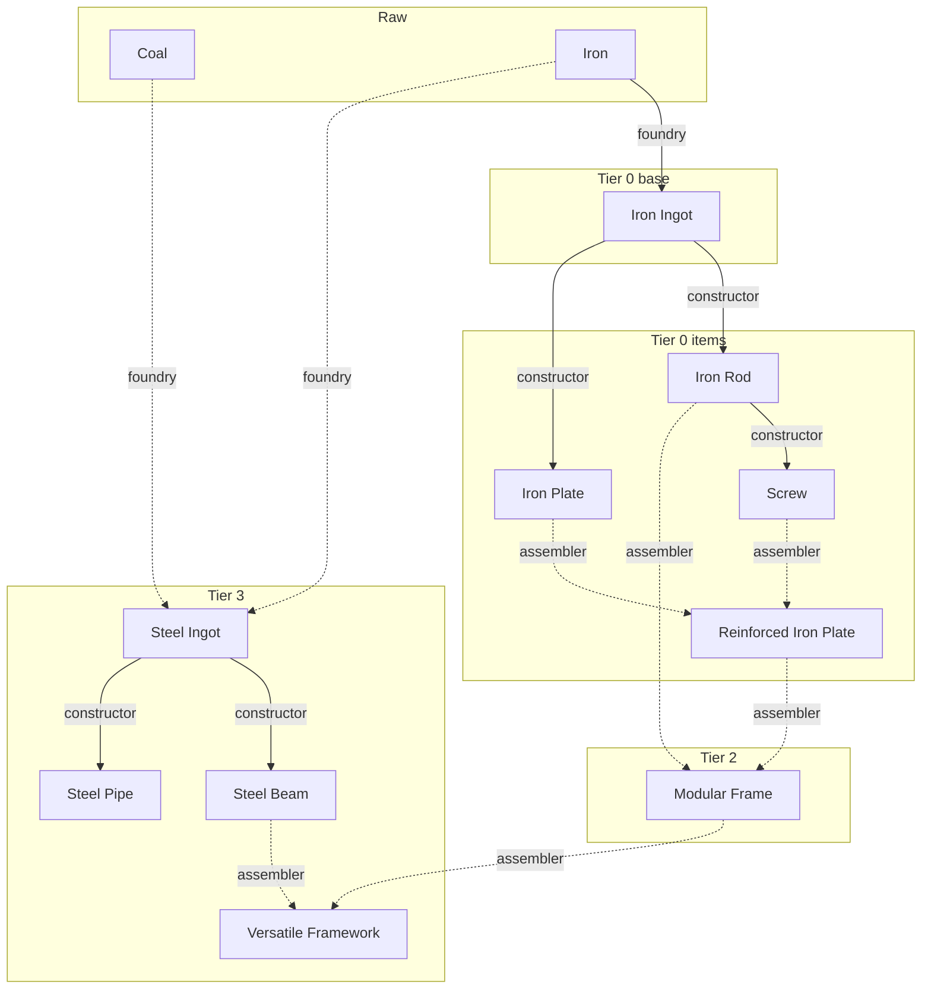
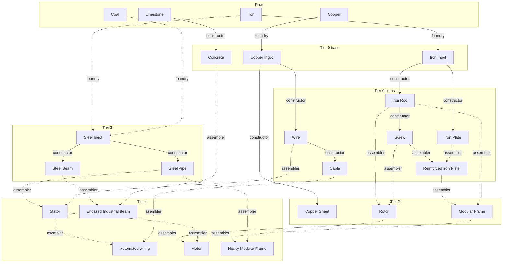
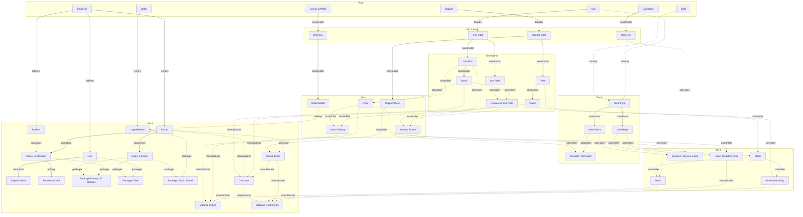

# Satisfactory


## Research availability



## Tier availability

### Tier 0



### Tier 2



### Tier 3



### Tier 4



### Tier 5



### Tier 7
```mermaid
graph TD;

%% Raw resources
subgraph Raw
ba[Bauxite]
co[Coal]
cop[Copper]
crud[Crude Oil]
l[Limestone]
fe[Iron]
su[Sulfur]
h2o[Water]
q[Raw Quartz]
ca[Caterium]
end

%% Tier 0
subgraph Tier 0 base
cop--foundry-->copi[Copper Ingot]
fe--foundry-->fei[Iron Ingot]
end
subgraph Tier 0 items
copi--constructor-->wir[Wire]
wir--constructor-->cab[Cable]
fei--constructor-->rod[Iron Rod]
fei--constructor-->pla[Iron Plate]
rod--constructor-->sc[Screw]
sc & pla-.assembler.->repl[Reinforced Iron Plate]
end

%% Tier 2 - no alts
subgraph Tier 2
copi--constructor-->cops[Copper Sheet]
repl & rod-.assembler.->mod[Modular Frame]
end

%% Tier 3 - no alts
subgraph Tier 3
fe & co -.foundry.-> st[Steel Ingot]
st --constructor--> stp[Steel Pipe]
end

%% Tier 4 - no alts
subgraph Tier 4
stp & wir -.assembler.-> stat[Stator]
stat & cab -.asembler.-> aw[Automated wiring]
mod & stp -.assembler.-> hmod[Heavy Modular Frame]
end

%% Tier 5 - no alts
subgraph Tier 5
crud --refinery--> plas[Plastic] 
plas & cops -.assembler.->cb[Circuit Board]
cb & cab & plas & sc -.manufacturer.-> pc[Computer]
aw & cb & hmod & pc -.manufacturer.-> acu[Adaptive Control Unit]
end

%% Research items
subgraph Research
q --constructor--> qc[Quartz Crystals]
qc & repl -.assembler.-> crysosc[Crystal Oscillator]
ca --foundry--> cai[Caterium Ingots]
cai --constructor--> qu[Quickwire]
cops & qu -.assembler.->ail[AI Limiter]
qu & cab & cb -.manufacturer.->hsc[High-Speed Connector]
pc & ail & hsc & plas -.manufacturer.-> spc[Supercomputer]
end

%% Tier 7 - no alts
subgraph Tier 7
ba & h2o -.refinery.-> als[Alumina Solution] --byproduct--> si[Silica]
als & co -.refinery.-> alsc[Aluminium Scrap] %% --byproduct--> h2o
als & si -.foundry.->ali[Aluminium Ingot]
ali & copi -.assembler.-> aas[Alclad Aluminium Sheet]
ali --constructor--> ac[Aluminium Casing]
su & h2o -.refinery.-> sua[Sulfuric Acid]
sua & als & ac -.blender.->bat[Battery]
ac & pc & crysosc-.manufacturer.-> rcu[Radio Control Unit]
acu & spc -.assembler.-> ads[Assembly Director System]
end
```

### Tier 8 - WIP!
```mermaid
graph TD;

%% Raw resources
subgraph Raw
ba[Bauxite]
ca[Caterium]
co[Coal]
cop[Copper]
crud[Crude Oil]
l[Limestone]
fe[Iron]
n[Nitrogren]
q[Raw Quartz]
sam[SAM ore]
su[Sulfur]
u[Uranium]
h2o[Water]
flora[Leaves & Wood]
end

%% Tier 0
subgraph Tier 0 base
flora--constructor-->bio[Biomass]
cop--foundry-->copi[Copper Ingot]
fe--foundry-->fei[Iron Ingot]
l--constructor-->con[Concrete]
end
subgraph Tier 0 items
copi--constructor-->wir[Wire]
wir--constructor-->cab[Cable]
fei--constructor-->rod[Iron Rod]
fei--constructor-->pla[Iron Plate]
rod--constructor-->sc[Screw]
sc & pla-.assembler.->repl[Reinforced Iron Plate]
end

%% Tier 2 - no alts
subgraph Tier 2
bio--constructor-->sbio[Solid Biofuel]
copi--constructor-->cops[Copper Sheet]
repl & rod-.assembler.->mod[Modular Frame]
rod & sc -.assembler.->rot[Rotor]
repl & rot -.assembler.->smpl[Smart Plating]
end

%% Tier 3 - no alts
subgraph Tier 3
fe & co -.foundry.-> st[Steel Ingot]
st --constructor--> stb[Steel Beam]
st --constructor--> stp[Steel Pipe]
stb & mod -.assembler.-> vf[Versatile Framework]
end

%% Tier 4 - no alts
subgraph Tier 4
stp & wir -.assembler.-> stat[Stator]
stat & cab -.asembler.-> aw[Automated wiring]
stb & con -.assembler.-> eib[Encased Industrial Beam]
rot & stat -.assembler.-> mot[Motor]
mod & stp -.assembler.-> hmod[Heavy Modular Frame]
end

%% Tier 5 - no alts
subgraph Tier 5
crud --refinery--> plas[Plastic] --byproduct--> hor[Heavy Oil Residue]
crud --refinery--> fu[Fuel] --byproduct--> por[Polymer Resin]
sbio & h2o -.refinery.-> lbio[Liquid Biofuel]
crud --refinery--> rub[Rubber] --byproduct--> hor
hor --refinery--> peco[Petroleum Coke]
plas --constructor--> ec[Empty Canister]
hor & ec -.packager.-> phor[Packaged Heavy Oil Residue]
fu & ec -.packager.-> pfu[Packaged Fuel]
lbio & ec -.packager.-> plbio[Packaged Liquid Biofuel]
plas & cops -.assembler.->cb[Circuit Board]
mot & rot & smpl -.manufacturer.-> me[Modular Engine]
cb & cab & plas & sc -.manufacturer.-> pc[Computer]
aw & cb & hmod & pc -.manufacturer.-> acu[Adaptive Control Unit]
end

%% Research items
subgraph Research
q --constructor--> qc[Quartz Crystals]
qc & repl -.assembler.-> crysosc[Crystal Oscillator]
ca --foundry--> cai[Caterium Ingots]
cai --constructor--> qu[Quickwire]
cops & qu -.assembler.->ail[AI Limiter]
qu & cab & cb -.manufacturer.->hsc[High-Speed Connector]
pc & ail & hsc & plas -.manufacturer.-> spc[Supercomputer]
end

%% Tier 7 - no alts
subgraph Tier 7
ba & h2o -.refinery.-> als[Alumina Solution] --byproduct--> si[Silica]
als & co -.refinery.-> alsc[Aluminium Scrap] %% --byproduct--> h2o
als & si -.foundry.->ali[Aluminium Ingot]
ali & copi -.assembler.-> aas[Alclad Aluminium Sheet]
ali --constructor--> ac[Aluminium Casing]
su & h2o -.refinery.-> sua[Sulfuric Acid]
sua & als & ac -.blender.->bat[Battery]
ac & pc & crysosc-.manufacturer.-> rcu[Radio Control Unit]
acu & spc -.assembler.-> ads[Assembly Director System]
end

%% Tier 8 - no alts
subgraph Tier 8 - WIP
copi --constructor-->copp[Copper Powder]
n & h2o & fep -.blender.-> na[Nitric Acid]
ali --constructor--> eft[Empty Fluid Tank]
end
```

### All non-alt item dependencies - WIP!
```mermaid
graph TD;

%% Raw resources
subgraph Raw
ba[Bauxite]
ca[Caterium]
co[Coal]
cop[Copper]
crud[Crude Oil]
l[Limestone]
fe[Iron]
n[Nitrogren]
q[Raw Quartz]
sam[SAM ore]
su[Sulfur]
u[Uranium]
h2o[Water]
flora[Leaves & Wood]
end

%% Tier 0
subgraph Tier 0 base
flora--constructor-->bio[Biomass]
cop--foundry-->copi[Copper Ingot]
fe--foundry-->fei[Iron Ingot]
l--constructor-->con[Concrete]
end
subgraph Tier 0 items
copi--constructor-->wir[Wire]
wir--constructor-->cab[Cable]
fei--constructor-->rod[Iron Rod]
fei--constructor-->pla[Iron Plate]
rod--constructor-->sc[Screw]
sc & pla-.assembler.->repl[Reinforced Iron Plate]
end

%% Tier 2 - no alts
subgraph Tier 2
bio--constructor-->sbio[Solid Biofuel]
copi--constructor-->cops[Copper Sheet]
repl & rod-.assembler.->mod[Modular Frame]
rod & sc -.assembler.->rot[Rotor]
repl & rot -.assembler.->smpl[Smart Plating]
end

%% Tier 3 - no alts
subgraph Tier 3
fe & co -.foundry.-> st[Steel Ingot]
st --constructor--> stb[Steel Beam]
st --constructor--> stp[Steel Pipe]
stb & mod -.assembler.-> vf[Versatile Framework]
end

%% Tier 4 - no alts
subgraph Tier 4
stp & wir -.assembler.-> stat[Stator]
stat & cab -.asembler.-> aw[Automated wiring]
stb & con -.assembler.-> eib[Encased Industrial Beam]
rot & stat -.assembler.-> mot[Motor]
mod & stp -.assembler.-> hmod[Heavy Modular Frame]
end

%% Tier 5 - no alts
subgraph Tier 5
crud --refinery--> plas[Plastic] --byproduct--> hor[Heavy Oil Residue]
crud --refinery--> fu[Fuel] --byproduct--> por[Polymer Resin]
sbio & h2o -.refinery.-> lbio[Liquid Biofuel]
crud --refinery--> rub[Rubber] --byproduct--> hor
hor --refinery--> peco[Petroleum Coke]
plas --constructor--> ec[Empty Canister]
hor & ec -.packager.-> phor[Packaged Heavy Oil Residue]
fu & ec -.packager.-> pfu[Packaged Fuel]
lbio & ec -.packager.-> plbio[Packaged Liquid Biofuel]
plas & cops -.assembler.->cb[Circuit Board]
mot & rot & smpl -.manufacturer.-> me[Modular Engine]
cb & cab & plas & sc -.manufacturer.-> pc[Computer]
aw & cb & hmod & pc -.manufacturer.-> acu[Adaptive Control Unit]
end

%% Research items
subgraph Research
q --constructor--> qc[Quartz Crystals]
qc & repl -.assembler.-> crysosc[Crystal Oscillator]
ca --foundry--> cai[Caterium Ingots]
cai --constructor--> qu[Quickwire]
cops & qu -.assembler.->ail[AI Limiter]
qu & cab & cb -.manufacturer.->hsc[High-Speed Connector]
pc & ail & hsc & plas -.manufacturer.-> spc[Supercomputer]
end

%% Tier 7 - no alts
subgraph Tier 7
ba & h2o -.refinery.-> als[Alumina Solution] --byproduct--> si[Silica]
als & co -.refinery.-> alsc[Aluminium Scrap] %% --byproduct--> h2o
als & si -.foundry.->ali[Aluminium Ingot]
ali & copi -.assembler.-> aas[Alclad Aluminium Sheet]
ali --constructor--> ac[Aluminium Casing]
su & h2o -.refinery.-> sua[Sulfuric Acid]
sua & als & ac -.blender.->bat[Battery]
ac & pc & crysosc-.manufacturer.-> rcu[Radio Control Unit]
acu & spc -.assembler.-> ads[Assembly Director System]
end

%% Tier 8 - no alts
subgraph Tier 8 - WIP
copi --constructor-->copp[Copper Powder]
n & h2o & fep -.blender.-> na[Nitric Acid]
ali --constructor--> eft[Empty Fluid Tank]
end
```
